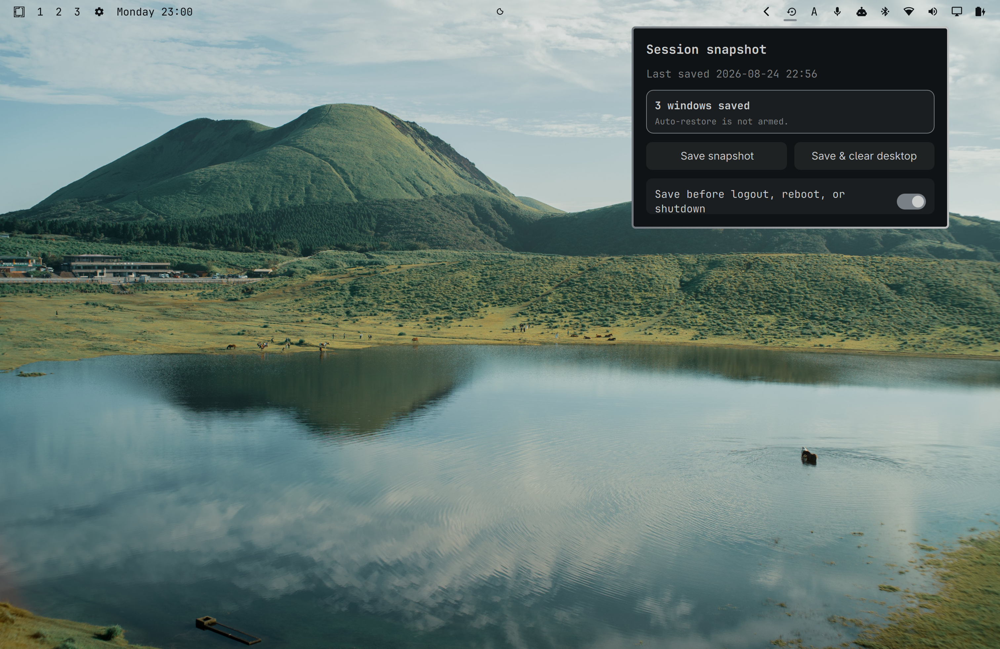

# Session Snapshot



## 0.2.0

- Fixed the shutdown-to-login hand-off so the service stops with the graphical
  session, arms the latest rolling snapshot even when Hyprland IPC has already
  disappeared or reports an empty desktop after application teardown, and
  keeps the restore marker when restoration is incomplete.
- Use the canonical plugin-ID installation path in systemd units and persist
  the default save-on-exit preference explicitly.
- Restore from a dedicated graphical-session systemd service so next-login
  recovery does not depend on the Omarchy shell or top-bar plugin running.
- Delay the rolling timer until login restoration finishes, preventing the new
  empty desktop from overwriting the snapshot that is about to be restored.
- Show a non-dismissible, theme-aware center-screen overlay with live
  application names and progress while saving before logout/reboot/shutdown
  and while restoring after login.

## About

### English

`hancore.session-snapshot` is designed for machines where system hibernation
cannot be enabled. It saves the user's working session before logout,
shutdown, reboot, or graphical-session exit, then restores it automatically at
the next login. This provides a pseudo-hibernate experience so users can
continue working where they left off.

The saved state includes launchable application windows, Hyprland workspaces
and positions, terminal directories, and detected tmux/zellij sessions. Kitty
windows are restored one-to-one: every saved Kitty OS window keeps its own
Kitty tabs/panes and its own workspace/position. The plugin never merges or
deduplicates sibling Kitty windows. Process memory, unsaved buffers, and
application-internal state cannot be preserved.

### 中文

`hancore.session-snapshot` 面向无法启用系统休眠的设备。在用户注销、关机、
重启或图形会话退出时，插件会保存当前工作区状态；下次登录后自动恢复，
从而模拟休眠效果，让用户可以继续之前未完成的工作。

它会保存可启动的应用窗口、Hyprland 工作区及窗口位置、终端目录，以及检测到
的 tmux/zellij 会话。Kitty 窗口会严格一对一恢复：每一个保存的 Kitty 操作系统
窗口都会保留自己的 Kitty 标签页/面板以及对应的 Hyprland 工作区和位置。插件
不会合并或去重 Kitty 窗口。进程内存、未保存的编辑内容和应用内部状态无法保存。

### 日本語

`hancore.session-snapshot` は、システムの休止状態を有効にできないマシン向けの
プラグインです。ログアウト、シャットダウン、再起動、またはグラフィカルセッション
の終了時に作業中のセッションを保存し、次回ログイン時に自動的に復元します。
これにより、休止状態に近い環境を実現し、前回の作業を続きから再開できます。

起動可能なアプリケーションウィンドウ、Hyprland のワークスペースとウィンドウ位置、
ターミナルのディレクトリ、検出された tmux/zellij セッションを保存します。Kitty
ウィンドウは一対一で復元されます。保存された各 Kitty OS ウィンドウは、それぞれの
Kitty タブ/ペインと Hyprland のワークスペース/位置を保持します。Kitty ウィンドウを
統合したり重複排除したりすることはありません。プロセスのメモリ、未保存のバッファ、
アプリケーション内部の状態は保存できません。

## Install

```sh
omarchy plugin add https://github.com/iamcheyan/omarchy-session-snapshot.git --enable
```

The plugin installs a top-bar widget and user-level systemd units for rolling
snapshots and save-on-session-end. It stores snapshot data under
`~/.local/state/omarchy-session-snapshot/` and does not require another
checkout at runtime.

Its menu follows the desktop state:

- when windows are open, show `Save snapshot` and `Save & clear desktop`;
- after `Save & clear desktop`, show `Restore snapshot` only while the desktop is empty;
- show whether a snapshot exists, how many windows it contains, and when it was saved;
- enable the default “save before logout, reboot, or shutdown” behavior;
- persist that preference at `~/.config/omarchy/session-save-on-exit`, which is
  also read by the shell power menu;
- preserve the existing automatic next-login restore marker and teardown-safe
  rolling snapshot logic.

The plugin contains its own session snapshot engine under `bin/` and does not
depend on another shell checkout. Snapshot data is kept under
`~/.local/state/omarchy-session-snapshot/session/`.

The plugin service installs user-level systemd links for a five-minute rolling
snapshot, a final save when the graphical session ends, and an independent
next-login restore service. The restore path waits for Hyprland IPC and does
not depend on the Omarchy shell or top bar being available.

## Remove

Disable the plugin before removing it so its user-level units are stopped:

```sh
omarchy plugin disable hancore.session-snapshot
omarchy plugin remove hancore.session-snapshot
```

Removing the plugin does not delete the saved snapshot state. Remove
`~/.local/state/omarchy-session-snapshot/` separately if you also want to clear
the saved session.

## Development

```sh
omarchy plugin validate .
qmllint -I "$OMARCHY_PATH/shell" bar/widget.qml SnapshotPanel.qml
```
